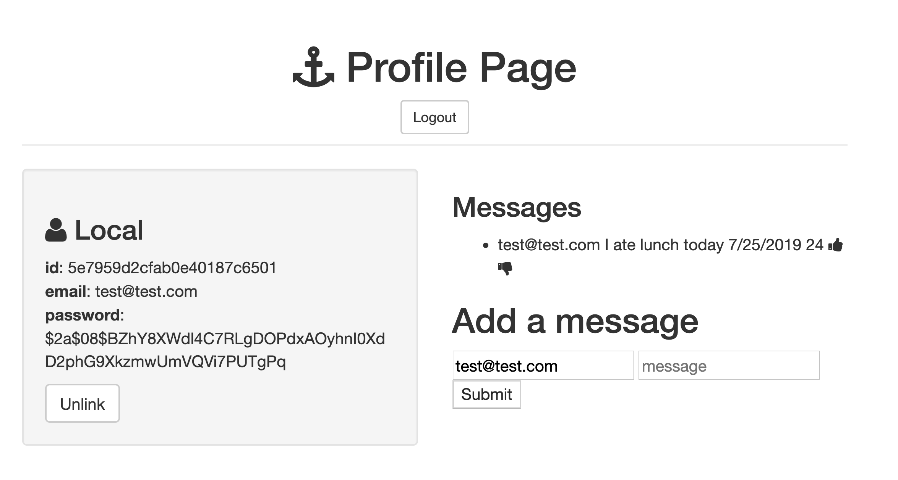

# Savage Message Board Full Stack App

Create an app where users can post messages to 21 Savage fan board with user authentication

### Development:
**Languages Used:** HTML, CSS, JavaScript, Node, Express, EJS template, MongoDB, User Authentication
First time using  User Authentication to allow users only see their posts when submitting to the message board

### Optimizations:
I learned a ton on the various components of a full stack app

## Installation

1. Clone repo
2. run `npm install`

## Usage

1. run `node server.js`
2. Navigate to `localhost:8080`
